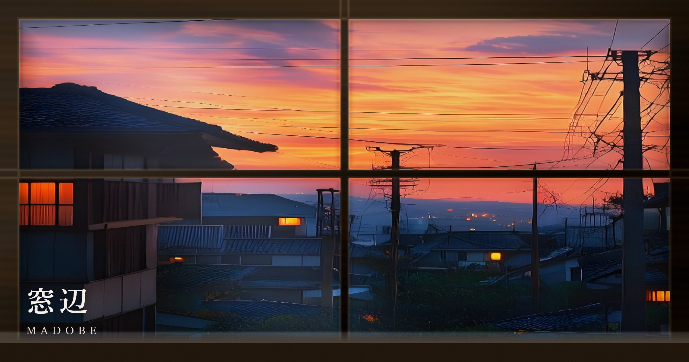

# 窓のむこう ｜ Beyond the Window

> 窓辺から眺めて、ととのう。そしてときどき、窓のむこうへ。



（旧名「窓辺 ｜ Madobe」。窓辺で眺めるだけのアプリから、窓のむこうの町へ飛び出して、歩いて、また帰ってくるアプリに育ったため改名）

四季 × 天気 × 時間帯 × 環境音を、ただ**眺めて・聴いて・整う**アンビエント・アプリ。
高台の窓辺から街・海・山・谷戸を見渡し、雨や雪や夕焼け・夜の灯りの中で心をしずめる。
描画は二本立て：**窓辺のシーンは WebGL（GLSL シェーダー）で「現象」を計算生成**し、
**立体の街・谷戸は Three.js で構築**して窓辺・上空・地上から眺める。さらに一部のシーンは、
窓の外に**実写級の画像**を重ねて格上げする（**開発時に一度だけ生成して保存し、本番は保存画像を表示するだけ＝実行時に外部 API は叩かない**）。

**▶ 体験する: https://yuya591-ux.github.io/seasons/**

## できること

- **情景を選ぶ**: 四季×天気×時間帯の組み合わせを 30 あまり収録（実写の窓／立体の街と谷戸／角部屋／海辺／山あい／屋上／鶴見・獅子ヶ谷の谷戸…）。
  時刻に合わせて空の色と光がゆっくり移ろう。「いま」ボタンで今の季節・時刻の窓辺へ（同じ軸に複数あれば日替わりで巡る）。
- **窓辺シリーズ**: 指でなぞって**見回す**／**窓をあける・しめる**（網戸・結露・ガラスの映り込み）／
  さらに**身を乗り出す**と窓枠が消えて景色だけを 180° 見渡す。端末の傾きでも見回せる。
- **立体の街と谷戸**: Three.js の本物の3Dの街を、窓辺から見下ろすだけでなく、**空を飛んで**滑空し、**着地して歩く**こともできる（季節ごとに四季の街）。
- **環境音**: 雨・遠雷・ヒグラシ・油蝉・波・カモメ・風・ウグイス・せせらぎ・カラス・虫の音…を情景ごとに重ねてループ。
  継ぎ目レスなループとクロスフェード、ステレオ定位、遠雷のゆらぎ。
- **おやすみタイマー**: 眺めているうちに、そっと暗転して音が引いて休む（描画と音を止めて電池にも配慮）。触れれば戻る。
- **オフライン対応（PWA）**: 一度開けば電波が無くても・将来サーバが消えても眺められる。ホーム画面に追加して全画面で。
- **配慮**: OS の「視差効果を減らす」に追従して揺れを止める。端末性能から初期品質を自動調整し、フレーム落ち時はさらに自動で軽くする。

## 技術スタック

- **描画（窓辺シーン）**: 生 WebGL のフルスクリーン・シェーダー（GLSL ES 1.00）。後処理に FXAA（輪郭の平滑化）。
  雨粒の屈折・水面・雲影・霧・粒子等を、画像を使わず計算で出す。
- **描画（立体の街・谷戸）**: **Three.js**（トゥーン／水彩調のセル表現＋静的影＋大気遠近）。窓辺・上空・地上の3視点で眺める。
- **窓の外の格上げ（任意）**: 一部のシーンは窓の外に**生成画像／実写級の画像**を重ねる。**画像は開発時に一度だけ生成して `public/bg/` に保存し、本番は保存画像を表示するだけ**（実行時に外部 API は叩かない）。出典は `CREDITS.md` と**アプリ内「設定 → この作品について」**に記録。
- **音**: Web Audio API。素材はライセンスが明確なフリー素材（CC0 / パブリックドメイン優先）のみ。出典は `CREDITS.md` に全数記録。
- **ビルド**: Vite ／ **ホスティング**: GitHub Pages（`main` への push で自動デプロイ）。
- **原則**: **実行時は**外部 API 非依存・課金なし・個人キー非依存（「自分がいなくなっても動く」＝生成は開発時のみ、配信は静的ファイルのみ）。

### 描画を二本立てにした理由

当初は「画面いっぱいの一枚絵をフラグメントシェーダーで描く」窓辺シリーズから始めた（生 WebGL は依存最小・起動が軽く、
GLSL を直接握って質感を作り込める）。その後「**本物の立体の街を、飛んで・歩いて眺めたい**」という方向が育ち、
立体の街・谷戸は Three.js で構築している。窓辺の現象シェーダーと、立体の街、さらに任意の生成背景層を、
同じ「器（情景データ）」の上に並べて選べる構成。

## 開発

```bash
npm install      # 初回のみ
npm run dev      # ローカル開発サーバ
npm run build    # 本番ビルド（dist/ を生成）
npm run preview  # ビルド結果のプレビュー（vite preview の既定 :4173。検証スクリプトは PORT 環境変数で接続先を合わせる）
```

検証: `node scripts/verify-scene.mjs <情景ID> <出力名>` で任意の情景を撮影（GLSL の実行時コンパイル失敗も検出）。
`node scripts/verify-fps.mjs <情景ID>` でフレームレート計測。サムネ生成は `node scripts/gen-thumbs.mjs`。

## ディレクトリ

```
index.html                  エントリ（OGP・PWA メタ）
public/                     manifest / icons / sw.js（オフライン）/ audio / thumbs
src/main.js                 結線（情景データ＋レンダラ＋音＋UI＋おやすみ＋PWA登録）
src/engine/renderer.js      窓辺シーンの WebGL レンダラ（情景ごとのシェーダー・自動品質・FXAA）
src/engine/town3dViewer.js  立体の街・谷戸の Three.js ビューア（窓辺／飛行／歩行の3視点）
src/shaders/                窓辺シーンの GLSL（rainGlass/photoWindow/windowSea/windowMountains/clearSky/…）
src/data/scenes/            情景データ（色×天気×時間帯×音の「器」）。追加はここに 1 ファイル＋index に 1 行
src/data/credits.js         アプリ内「この作品について」で見せる素材クレジット（CREDITS.md と一致）
src/audio/audio.js          環境音のレイヤー再生（継ぎ目レスループ／クロスフェード）
src/ui/                     最小限の UI（情景選択・設定・見回し・傾き）
.github/workflows/          GitHub Pages 自動デプロイ
```

新しい情景の追加は「色データ＋音ファイルを足すだけ」で済む（既存を壊さない非破壊・疎結合）。

## 著作権・素材

環境音などの素材はライセンスが明確なフリー素材のみを使い、出典・作者・ライセンスを `CREDITS.md` に全数記録している。
また配信物の中でも帰属できるよう、**アプリ内「設定 → この作品について」**から作者・ライセンス・出典を閲覧できる
（CC BY / CC BY-SA 素材の帰属義務に対応）。既存作品の固有の音・絵・名称は模倣しない。
ライセンスは `LICENSE`（独自部分は MIT、第三者素材は各ライセンス継承）を参照。
